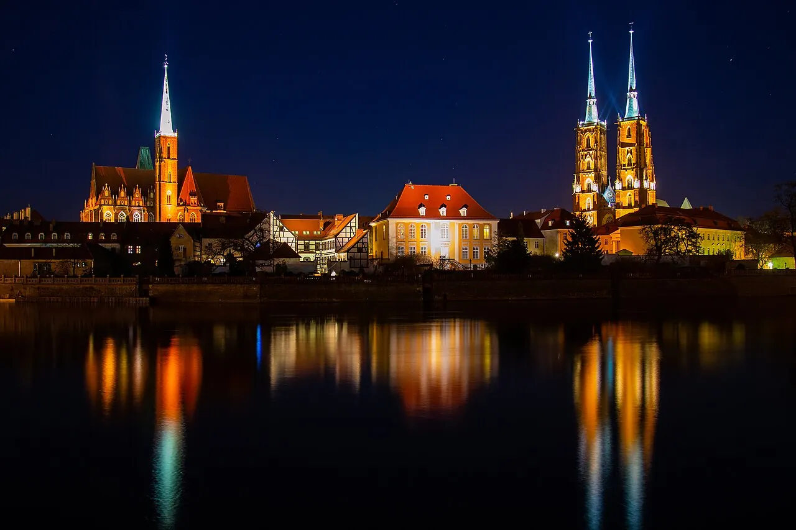

# POLSKA｜波蘭四城旅行誌

十月底，搭火車走過波蘭的四座城市。從華沙老城的傍晚開始，走進克拉科夫的廣場與歷史街區，在樂斯拉夫河岸等燈亮起，再到波茲南吃一塊聖馬丁牛角麵包，最後回到華沙。

**航空往返｜2026/10/23–11/01**

**波蘭旅程｜2026/10/24–10/31 · 8 天 7 夜**

**旅行路線｜華沙 → 克拉科夫 → 樂斯拉夫 → 波茲南 → 華沙**

[打開旅行誌](https://polandtrip.xiehnet.com/) · [今天怎麼走](https://polandtrip.xiehnet.com/today) · [出發前的準備](https://polandtrip.xiehnet.com/practical/essentials)

## 四座城市，四種風景

- **[華沙 Warszawa](https://polandtrip.xiehnet.com/city-warszawa)**：老城廣場、皇家大道與皇家城堡；透過 POLIN 和華沙起義博物館，認識城市重建背後的歷史。留一個夜晚給老城燈光與熱巧克力。
- **[克拉科夫 Kraków](https://polandtrip.xiehnet.com/city-krakow)**：Wawel、中央廣場、Kazimierz 街區與辛德勒工廠。以這裡為落腳點，一日往返 Auschwitz-Birkenau，也安排走入 Wieliczka 鹽礦。
- **[樂斯拉夫 Wrocław](https://polandtrip.xiehnet.com/city-wroclaw)**：在廣場和巷子裡找小矮人，看拉茨瓦維採全景畫，再到座堂島等煤氣燈點亮，沿河散步。
- **[波茲南 Poznań](https://polandtrip.xiehnet.com/city-poznan)**：教堂島、老市集廣場與中午的山羊鐘樓秀；把聖馬丁牛角麵包和馬鈴薯料理留給這一天。

七晚分別住在華沙 1 晚、克拉科夫 2 晚、樂斯拉夫 1 晚、波茲南 1 晚，再回華沙 2 晚。城市之間以火車串起，抵達後盡量放下行李再出門。

## 八天的旅行輪廓

| 日期 | 落腳與移動 | 這一天想留下的記憶 |
|---|---|---|
| [10/24（六）· Day 1](https://polandtrip.xiehnet.com/day-01) | 抵達華沙 | 老城與皇家大道傍晚漫步，吃一餐波蘭地方料理，早點休息倒時差。 |
| [10/25（日）· Day 2](https://polandtrip.xiehnet.com/day-02) | 華沙 → 克拉科夫 | Wawel、中央廣場與辛德勒工廠；晚間走進 Kazimierz，嚐嚐 Plac Nowy 的烤長麵包。 |
| [10/26（一）· Day 3](https://polandtrip.xiehnet.com/day-03) | 克拉科夫出發，一日往返 | Auschwitz-Birkenau 導覽。留時間理解歷史，回城後安排安靜的晚餐與休息。 |
| [10/27（二）· Day 4](https://polandtrip.xiehnet.com/day-04) | 克拉科夫 → 樂斯拉夫 | 上午參觀 Wieliczka 鹽礦，回城取行李，傍晚搭車前往下一座城市。 |
| [10/28（三）· Day 5](https://polandtrip.xiehnet.com/day-05) | 樂斯拉夫 → 波茲南 | 廣場小矮人、教堂塔樓、全景畫與國家博物館；傍晚在座堂島看點燈，再搭車往波茲南。 |
| [10/29（四）· Day 6](https://polandtrip.xiehnet.com/day-06) | 波茲南 → 華沙 | 教堂島、山羊鐘樓秀與聖馬丁牛角麵包；午後逛帝王城堡與 Stary Browar，晚間回華沙。 |
| [10/30（五）· Day 7](https://polandtrip.xiehnet.com/day-07) | 華沙 | 皇家城堡、POLIN 與華沙起義博物館，是較充實的一天；晚餐在起義博物館旁的 WYRAJ，最後留給老城夜景。 |
| [10/31（六）· Day 8](https://polandtrip.xiehnet.com/day-08) | 華沙 → 返程 | 吃早餐、整理行李，前往蕭邦機場；11/01 回到臺灣。 |

這是目前的旅行安排；各館場次與購票進度可在[訂票清單](https://polandtrip.xiehnet.com/practical/todos)查看。

## 把休息時間留給一口波蘭味

在牛奶吧吃一餐樸實的熱食，試試波蘭餃子 **pierogi**；克拉科夫的夜晚，留給 **zapiekanka** 烤長麵包。到了波茲南，嚐聖馬丁牛角麵包，再把 **Pyra Bar** 的馬鈴薯料理放進午餐候選。

華沙可以在 **Wedel** 喝熱巧克力，晚班火車回城後到 **Hala Koszyki** 找晚餐。樂斯拉夫若有空檔，就在老城停下喝咖啡、吃甜點。店家與餐段安排整理在[餐飲指南](https://polandtrip.xiehnet.com/practical/dining)，想帶點零食回去，也可以翻翻[超市採買](https://polandtrip.xiehnet.com/practical/groceries)與[伴手禮](https://polandtrip.xiehnet.com/practical/shopping)。

## 十月底，帶著秋天出發

保暖外套、圍巾、雨具和好走的鞋，比多排一個景點更實用。**10/25 起切換冬令時間**，天黑得早，把戶外散步和拍照放在白天，晚間留給室內參觀、晚餐或休息。

轉城日先想好行李寄放與取回；票券和住宿確認先存好，旅途中的注意力就能留給街景。行程有緊湊的日子，也盡量保留一杯咖啡、一段河岸和不急著趕路的空檔。

出門時打開[今日速查](https://polandtrip.xiehnet.com/today)，想知道下一段怎麼走，就看[交通指南](https://polandtrip.xiehnet.com/practical/transit)。讓這份旅行誌陪著走，把真正的回憶留在路上。
